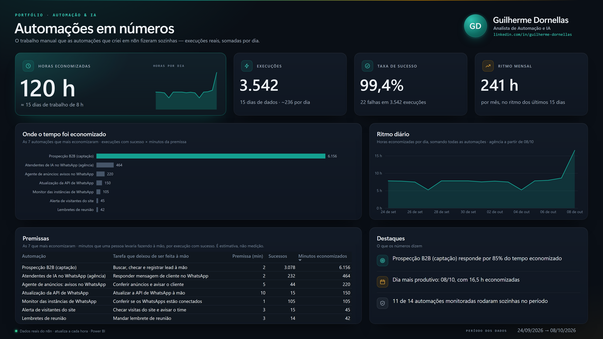

# Guilherme Dornellas · Automação e IA

**Analista de Automação e IA.** Criei e lidero o setor de Automação e IA de uma agência de marketing. 
Mais de 4 anos em mídia paga guiada por dados (Meta Ads e Google Ads). 
Cursando Engenharia de Produção na Univesp.

## Painel ao vivo: automações em números

**[Abrir o painel ao vivo](https://app.powerbi.com/view?r=eyJrIjoiMWQ4ODEwYWMtOGQ1MS00MjFlLWIwOGEtYWU3OWM4YTNlMmNjIiwidCI6IjE1ZTY3M2M5LWFlMDItNGNiOS1iNzg1LWRkMzgxOWE2ODk2MCJ9)**: horas economizadas, execuções, taxa de sucesso e a premissa de cada automação, com dados reais do n8n (as minhas automações e as que criei para a agência), atualizados a cada hora.

Como foi feito, sem Power BI Desktop e no plano gratuito:

- **Dados:** workflows do n8n resumem as execuções por dia (o da agência lê outro n8n só com permissão de leitura); outro envia as linhas para o Power BI pela API REST, autenticado por OAuth com um app registrado no Microsoft Entra.
- **Modelo:** modelo semântico criado pela API, com 3 tabelas (fato, automações e calendário), relacionamentos e 20 medidas DAX.
- **Relatório:** layout escrito como código (formato PBIR, via API do Fabric), tema escuro com paleta validada para daltonismo e fundo desenhado em HTML.
- **Premissa:** minutos que uma pessoa levaria fazendo a tarefa à mão, por execução com sucesso. É estimativa e aparece no próprio painel.

## Cases

| # | Case | O que prova | Número principal |
|---|---|---|---|
| 01 | [Máquina de prospecção B2B](cases/01-maquina-de-prospeccao-b2b/) | Pipeline de dados de ponta a ponta: base pública, scraping, CRM, IA e geração de sites | Meta de ~450 leads captados por noite; consulta de 3,24 s para 15 ms |
| 02 | [Agente auditor de anúncios](cases/02-agente-auditor-de-anuncios/) | IA que diagnostica contas de anúncio e só executa com aprovação humana e travas de segurança | 10 de 10 ensaios de falha antes de ir para produção |
| 03 | [Secretária IA no WhatsApp](cases/03-secretaria-ia-whatsapp/) | Produto SaaS com LLM usando ferramentas reais, guardrails e isolamento por cliente | 701 testes automatizados; agendamento real pelo WhatsApp |
| 04 | [Plataforma de automação auto-hospedada](cases/04-plataforma-de-automacao-auto-hospedada/) | Infraestrutura em produção com resiliência, backup e baixo custo | Backup diário com restauração testada; 7 stacks migradas sem perda de dados |

Cada case segue o mesmo roteiro: problema, solução (com diagrama), ferramentas, resultados, desafios e aprendizados, e o que eu faria diferente.

## Stack principal

- **Automação:** n8n, webhooks, Evolution API (WhatsApp), Notion API, Baserow
- **IA:** Claude Code (agentes e tarefas agendadas), Gemini, Groq e OpenRouter, LLM com ferramentas (tool calling), verificação adversarial com múltiplos agentes
- **Código:** Python (Flask, FastAPI, Playwright), TypeScript e Node.js (Next.js, React), SQL
- **Dados:** PostgreSQL, Redis, BullMQ, Power BI (API REST, DAX, PBIR)
- **Mídia paga:** Meta Marketing API, Google Ads API
- **Infraestrutura:** Docker Swarm, Traefik, Portainer, Cloudflare, Linux

## Esqueletos de workflow n8n

A pasta [`workflows/`](workflows/) traz a estrutura (nós e conexões) de dois workflows reais, **sem parâmetros, credenciais ou dados**:

- [`maquina-de-prospeccao-b2b.esqueleto.json`](workflows/maquina-de-prospeccao-b2b.esqueleto.json): workflow principal do case 01 (97 nós, dos quais 20 são notas de documentação, aqui vazias).
- [`alerta-de-visitantes.esqueleto.json`](workflows/alerta-de-visitantes.esqueleto.json): alerta de visitantes de um site, citado no case 04 (5 nós).

## Sobre os dados

Nomes de clientes, marcas, domínios, contatos e detalhes sensíveis de infraestrutura foram omitidos ou anonimizados. Os números vêm da documentação técnica de cada projeto, escrita durante o desenvolvimento.

## Contato

[LinkedIn](https://www.linkedin.com/in/guilherme-dornellas/)
