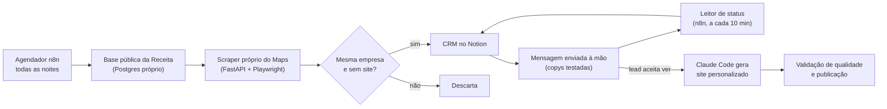

# Case 01 · Máquina de prospecção B2B

> Pipeline que encontra clínicas sem site, confirma que são a empresa certa, organiza tudo num CRM e gera um site de amostra personalizado para a abordagem.
>
> Contexto: projeto próprio, construído e operado por mim.

## Problema

Clínicas de ticket alto (harmonização, ortodontia, implantes, estética) que não têm site são bons clientes para um pacote de presença digital. Mas encontrá-las à mão é lento: é preciso cruzar dados públicos de empresas com o Google Maps, descobrir quem não tem site e qual telefone usar. E abordagem genérica quase não gera conversa.

## Solução

1. **Captação noturna (n8n):** consulta a base pública da Receita Federal por nicho e cidade, busca cada empresa no Google Maps com um scraper próprio, confirma que é a mesma empresa (endereço, CEP ou telefone), filtra quem não tem site e grava o lead no CRM (Notion).
2. **Leitura das respostas:** a cada 10 minutos, um leitor de status dentro do n8n identifica qual variação de mensagem foi enviada e quem respondeu (decisor, recepção, robô, número errado) e atualiza o CRM sozinho.
3. **Site de amostra:** quando o lead aceita, um comando no Claude Code gera um site com os dados reais da clínica a partir de um template por nicho, valida a qualidade (Lighthouse e html-validate) e publica.

O esqueleto do workflow principal (nós e conexões, sem parâmetros nem credenciais) está em [`workflows/maquina-de-prospeccao-b2b.esqueleto.json`](../../workflows/maquina-de-prospeccao-b2b.esqueleto.json).

## Ferramentas

n8n · PostgreSQL · Python (FastAPI + Playwright) · Node.js · Notion API · Evolution API (WhatsApp) · Groq (LLM) · Claude Code · Docker Swarm · Lighthouse

## Resultados

- **Meta de ~450 leads captados por noite**, numa rodada de 5 a 6 horas. O gargalo é o scraper (13 a 16 s por empresa).
- **~19,7 milhões de estabelecimentos ativos** na base do meu Postgres. Com um índice dedicado, a consulta por combinação caiu de **3,24 s para 15 ms**.
- O scraper próprio substituiu um serviço pago de scraping (cerca de $5 por dia).
- **Workflow principal com 97 nós.** A lógica das mensagens fica num único arquivo de código, que gera os nós do n8n automaticamente.
- A abordagem antiga (8 mensagens, 961 caracteres) teve 24 respostas e **0 reuniões**. As mensagens foram reescritas para pedir permissão ("posso montar e te mandar?"), não agenda.

## Desafios e aprendizados

- **Números de WhatsApp banidos.** O envio automático para contatos frios (cerca de 35 por número por dia), somado a chips rodando num app não oficial, derrubou os 10 números de prospecção. Desliguei o envio com um kill switch reversível: captação e CRM seguem automáticos, e **as mensagens passaram a ser enviadas à mão**. Lição: o risco de ban vem do volume frio, não do texto.
- **Match errado.** Sem a cidade na busca, o Google devolvia empresa de outra cidade. Hoje a cidade é obrigatória e existe verificação de match; o erro residual medido é de ~10,5%.
- **Robôs inflando o funil.** O status passou a refletir o que foi enviado, não o que o lead respondeu, e só conta como prospecção a conversa que casa com o CRM: de 138 conversas, 34 tinham a frase de abertura, mas só 2 delas eram leads.
- **Medir antes de mexer.** 76% dos leads têm telefone fixo na Receita, e só 15 de 95 viraram WhatsApp válido. Antes de investir em enriquecimento de dados, o leitor de status está medindo quem de fato atende.

## O que eu faria diferente

- Começaria pela API oficial do WhatsApp Business, com números dedicados e volume baixo.
- Guardaria o identificador do lugar no Google (Place ID) desde o primeiro dia, para conseguir corrigir o match de leads antigos.
- Mediria quem atende o telefone cadastrado antes de automatizar qualquer abordagem.
