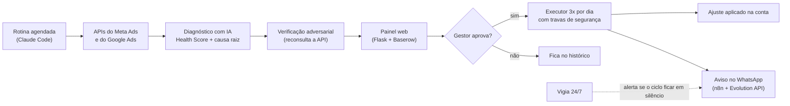

# Case 02 · Agente auditor de anúncios

> Agente de IA que audita contas de Meta Ads e Google Ads, aponta a causa raiz de cada problema e só mexe na conta depois que um humano aprova.

## Problema

Gerir várias contas de tráfego pago exige conferir números todos os dias, achar a causa de cada queda (criativo? público? cobrança?) e ajustar com cuidado, porque cada mudança errada gasta dinheiro do cliente. Relatórios costumam ser vagos e a execução é toda manual.

## Solução

1. **Diagnóstico:** uma rotina agendada do Claude Code puxa os dados das APIs do Meta e do Google, calcula um Health Score de 0 a 100 (nota de A a F) com benchmarks brasileiros por nicho e precisa chegar à causa raiz, com ação concreta. "Investigar" não é aceito como recomendação.
2. **Verificação adversarial:** um segundo agente reconsulta a API para conferir cada número.
3. **Aprovação:** o relatório vai para um painel web com login. Cada recomendação diz se a IA executa ou se é tarefa manual, e o gestor aprova com um clique.
4. **Execução com travas (3 vezes por dia):** aplica só o aprovado, nunca apaga nada, limita aumento de verba a +30% por vez, respeita piso de R$ 6 por dia por conjunto, descarta aprovação vencida, registra o estado antes e depois e tem kill switch.
5. **Avisos:** resumo no WhatsApp do gestor (n8n + Evolution API) e uma mensagem pronta para o cliente, escrita por LLM. Um vigia 24/7 no servidor alerta se o ciclo ficar em silêncio.

**Créditos:** o diagnóstico parte das skills open source **Ads Ratos** (`ads-ratos`, `meta-ads-ratos`, `google-ads-ratos` e `ga4-ratos`), de [duduesh](https://github.com/duduesh) (Ratos de IA), sob licença MIT. Corrigi e adaptei essas skills e construí o restante: agendamento, painel, executor com travas, vigia e notificações.

## Ferramentas

Claude Code (tarefas agendadas) · Python · Flask · Baserow · Meta Marketing API · Google Ads API · n8n · Evolution API (WhatsApp) · Groq (LLM) · Docker Swarm

## Resultados

- **9 contas de anúncio reais** (Meta e Google), de setores como imobiliário, segurança eletrônica, engenharia e marketing.
- O executor só foi liberado depois de **10 de 10 ensaios de falha**: token expirado, timeout, WhatsApp fora do ar, verba absurda, execução em dobro, entre outros.
- Uma auditoria com vários agentes levantou **50 achados confirmados**. As correções foram conferidas no código, e os testes das travas chegaram a **24 de 24** passando.
- Na primeira rodada real, a verificação corrigiu a causa raiz de uma conta parada havia 16 dias: não era pagamento, era o limite de gasto da conta esgotado.
- Uma cascata de 3 bugs fazia só **9 de 17** ajustes aprovados serem aplicados. Depois da correção, **17 de 17**.
- Painel endurecido contra CSRF, XSS e força bruta no login.
- Situação atual: as rotinas agendadas estão desligadas desde o fim de julho de 2026; o painel e o vigia seguem no ar.

## Desafios e aprendizados

- **IA não aplica nada sozinha.** Relatório automático é seguro; mexer em verba não é. Por isso, a IA sugere e o gestor aprova.
- **O verificador precisa ir à fonte.** Conferindo só o material do primeiro agente, ele chegou a marcar número real como inventado; hoje reconsulta a API.
- **Falha silenciosa é o pior bug.** Uma queda de ~1 minuto do LLM fez mensagens sumirem sem aviso (hoje: 3 tentativas e alerta), e as rotinas chegaram a "disparar" sem rodar por apontarem para uma pasta renomeada. O vigia existe para pegar esse silêncio.
- **Regra de negócio precisa ser explícita.** Pausei um conjunto sem redistribuir a verba e o investimento diário da conta caiu. Virou regra: pausar ou reduzir exige redirecionar a verba.

## O que eu faria diferente

- Começaria pelo vigia e pelos ensaios de falha, antes de qualquer automação mexer em conta real.
- Rodaria o agendador no servidor, para não depender de um computador ligado.
