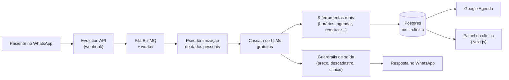

# Case 03 · Secretária IA no WhatsApp

> SaaS para clínicas de estética com uma secretária de IA que conversa no WhatsApp, consulta a agenda real, agenda, remarca e cobra sinal via Pix.
>
> **Status: produto em demonstração. Ainda não tem cliente pagante.**

## Problema

Clínicas de estética perdem pacientes no WhatsApp: a mensagem que chega à noite fica sem resposta, a recepção passa horas repetindo preço e horário, e falta sem sinal pago custa caro. Além disso, agenda, clientes, financeiro e prontuário costumam ficar em ferramentas separadas.

## Solução

Um sistema multi-clínica (cada clínica isolada das outras) com painel web e atendente de IA:

- A mensagem da paciente entra numa fila, e um worker separado chama uma cascata de LLMs gratuitos. Se um provedor cair, o próximo assume.
- A IA usa **9 ferramentas reais**, como consultar horários livres, agendar, remarcar e cancelar. Ela não inventa horário: lê a agenda do banco.
- Entende áudio e lê comprovante de Pix por visão computacional. Se o valor não bate, o pagamento fica aguardando conferência humana.
- Guardrails: se a resposta da IA oferecer desconto (caso típico de manipulação pelo cliente), ela é bloqueada, a IA pausa e a dona da clínica é avisada; pedido de descadastro é respeitado; e os dados pessoais são pseudonimizados antes de ir para o LLM.
- Sincroniza com o Google Agenda e tem painel com agenda, CRM, estoque, financeiro, comissões, prontuário e marketing, com 5 papéis de acesso.

## Ferramentas

Next.js 15 · React 19 · TypeScript · PostgreSQL (Drizzle ORM) · Redis + BullMQ · Evolution API (WhatsApp) · Gemini, Groq, Cerebras, Mistral e OpenRouter · Google Calendar API · Vitest · Docker Swarm

## Resultados

- **Fluxo completo provado em produção:** a paciente manda mensagem, a IA responde com o preço da tabela, oferece horários livres reais, agenda de verdade e cobra o sinal.
- **701 testes automatizados**, com checagem de tipos, lint e build passando.
- Auditoria do atendimento com 13 agentes: **64 achados**, mais 9 de um agente crítico. Depois, 4 rodadas de revisão cética até convergir (15, 5, 5 e, por fim, só casos de borda).
- A verificação adversarial antes dos deploys pegou cerca de **15 falhas reais**, incluindo uma funcionalidade inteira que estava inerte enquanto testes, lint e tipos passavam.
- Google Agenda: **16 de 16** agendamentos futuros sincronizados no teste em produção.
- **Custo zero de infraestrutura e de API:** roda no meu servidor e em planos gratuitos de LLM.

## Desafios e aprendizados

- **LLM erra data.** O modelo errava a conta de dias ("terça" virava o dia errado) mesmo com calendário no prompt. Solução: datas resolvidas em código, de forma determinística.
- **Filtro por palavra-chave tem limite.** Cada ajuste no filtro de "conselho clínico" trocava um falso positivo por um falso negativo, e como bloqueio ele travava a venda. Virou só registro para a dona revisar; o passo certo é um classificador semântico.
- **Quando cada correção abre outro buraco, troque a arquitetura.** A sincronização usava IDs fixos de evento, e o Google guarda os IDs apagados. Depois de 7 rodadas de revisão, adotei o padrão que o próprio Google recomenda.
- **Erro engolido esconde bug.** Um identificador de tarefa era rejeitado pela fila em silêncio e nada sincronizava. E o worker podia cair sem o health check do app perceber; hoje o deploy verifica os dois.
- **Número de WhatsApp queimado.** O número da demonstração estava em duas instâncias e ligado a um aquecedor de chips, e o WhatsApp restringiu o envio dele. Regra: um número, uma instância, chip dedicado e limpo.

## O que eu faria diferente

- Ativaria o isolamento no próprio banco (RLS do Postgres) desde o início, como segunda barreira entre clínicas.
- Usaria a API oficial do WhatsApp em produção; o código já está preparado para isso.
- Faria a revisão jurídica de LGPD antes, e não no fim.
