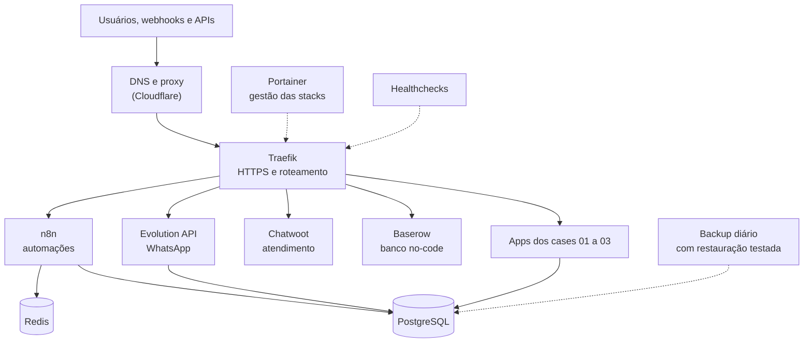

# Case 04 · Plataforma de automação auto-hospedada

> Duas plataformas self-hosted, uma na agência de marketing onde trabalho e outra na minha infraestrutura própria, que rodam n8n, API de WhatsApp, atendimento, bancos de dados e os apps dos outros cases, com foco em resiliência e custo baixo.

## Problema

Automação de marketing depende de várias peças rodando o tempo todo. Em SaaS, o custo cresce por usuário e os dados ficam fora do nosso controle. Auto-hospedar resolve isso, mas cria outro problema: alguém precisa garantir que o servidor não caia, não lote o disco e não perca dados.

## Solução

As duas plataformas usam a mesma base: **Docker Swarm**, **Traefik** (HTTPS e roteamento), **Portainer** (gestão das stacks), **PostgreSQL** e **Redis**, com n8n, Evolution API (WhatsApp), Chatwoot e Baserow.

**Na agência onde trabalho:**

- Migração para um servidor com mais memória e acesso administrativo só por túnel com 2 fatores.
- Auto-cura em duas camadas: healthchecks que reiniciam container travado e um monitor externo que avisa em até 5 minutos se o servidor cair.
- n8n em modo fila, com réplicas de webhook para absorver picos de mensagens.
- Rotação de logs, limpeza semanal automática de imagens e versões fixadas, além de um runbook para cada armadilha encontrada.

**Na minha infraestrutura própria** (servidor ARM em nuvem, plano gratuito, 4 núcleos e 24 GB de RAM), montada do zero em etapas:

- Backup diário com restauração testada, enviado para armazenamento de objetos, com 14 cópias guardadas.
- Healthchecks em quase todos os serviços, imagens com versão fixada e limpeza automática.
- Hospeda os apps dos cases 01 a 03 e workflows de monitoramento, como um alerta de visitantes de site sem rastreador no navegador ([esqueleto](../../workflows/alerta-de-visitantes.esqueleto.json)).

Arquitetura da infraestrutura própria (a da agência segue a mesma base):

## Ferramentas

Docker Swarm · Traefik · Portainer · PostgreSQL · Redis · n8n · Evolution API · Chatwoot · Baserow · Cloudflare · Linux (Ubuntu) · cron e Bash · armazenamento de objetos compatível com S3

## Resultados

**Na agência:**

- Fluxos presos na fila: o worker do n8n reiniciava em loop por um conflito de nomes entre serviços e por um healthcheck copiado do serviço errado. Corrigi as duas causas, saneei **1.100 execuções "zumbis"** e as pendências reais foram a zero.
- Removi um serviço de mensageria sem uso que ocupava ~7 GB de disco e consumia memória.

**Na infraestrutura própria:**

- **Restauração validada** em containers isolados: n8n (74 tabelas), Evolution API (37) e Chatwoot (91).
- **7 stacks migradas** da linha de comando para o Portainer com **zero perda de dados**.
- Migrei um app de processamento de vídeo com IA de um servidor x86 para ARM, com todas as dependências funcionando.

## Desafios e aprendizados

- **Erro 404 do proxy não é serviço fora do ar.** Um redeploy apagou os rótulos de roteamento do n8n: o container estava saudável, mas sem rota. Hoje valido a rota com uma requisição real depois de todo redeploy.
- **O "servidor morto" que não estava morto.** A máquina foi reiniciada várias vezes por suspeita de loop de boot; o problema era a rota do provedor de internet até a nuvem. Lição: testar de dentro da nuvem antes de mexer no servidor.
- **O nome da stack é o prefixo dos volumes.** Recriar com o mesmo nome reconecta os dados; mudar uma letra sobe o app vazio.
- **Mito desfeito:** o Portainer não limpa imagens antigas sozinho. Sem uma rotina agendada, o disco enche.
- **Healthcheck tem que testar o processo certo.** O worker herdava o teste HTTP do editor do n8n, falhava e era derrubado em loop.

## O que eu faria diferente

- Infraestrutura como código desde o começo, com os arquivos das stacks versionados em Git e revisados antes de aplicar.
- Alertas centralizados (disco, serviço parado, fila travada), em vez de descobrir o problema pelo sintoma.
- Volumes nomeados para todos os bancos de dados desde o primeiro deploy.
